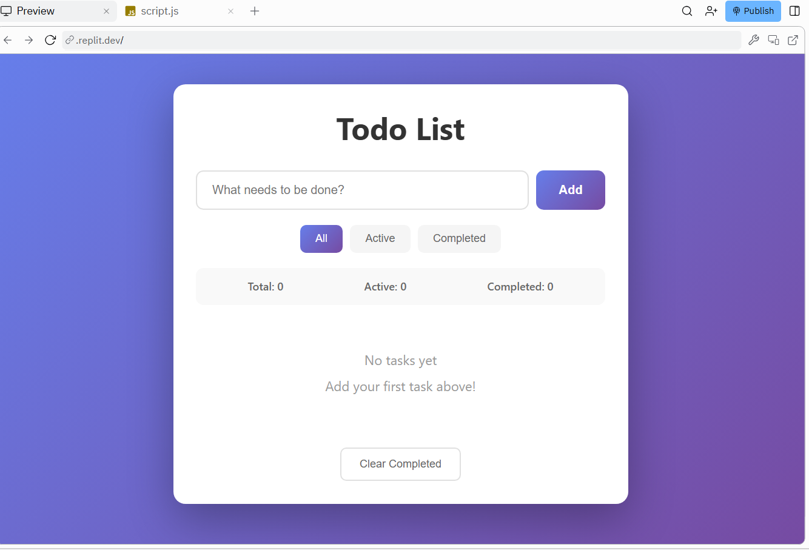
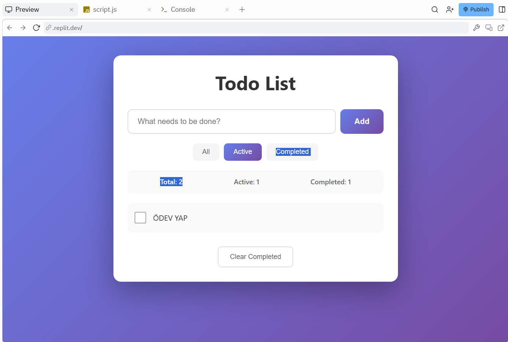

# vibe-coding-todo-app


# Vibe Coding Todo List App

A functional Todo List web application built using **HTML, CSS, and JavaScript** with the help of **Replit Agent**, an AI-powered vibe coding tool.

## Screenshots

### Main View


### Completed Tasks Filter


### Edit Task Example


## Features
- Add new tasks
- Edit existing tasks
- Delete tasks
- Mark tasks as completed or uncompleted
- Filter tasks (All / Active / Completed)
- Display task counts (total, active, completed)
- Persist data using browser localStorage
- Clean and responsive UI

## Technologies Used
- HTML5
- CSS3
- JavaScript (Vanilla)
- Replit Agent (AI-assisted development)

## Setup and Run
1. Clone the repository:
   ```bash
   git clone https://github.com/iremsukaya/vibe-coding-todo-app.git
